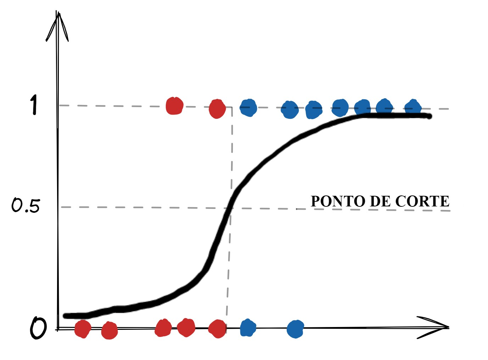

## Como funciona a Regressão Logística

O algoritmo de regressão logística faz parte dos algoritmos de aprendizado de máquina supervisionado e é utilizado para problemas nos quais a variável resposta é categórica, podendo ser do tipo binomial (apenas dois níveis) ou multinomial (três ou mais níveis).

Em nosso curso, vamos trabalhar com a variável categórica do tipo binomial. O intuito desse algoritmo é modelar a probabilidade de uma determinada classe. Para uma variável alvo com as classes 0 e 1, por exemplo, caso a probabilidade de um registro seja maior que um determinado ponto de corte, o modelo classifica esse registro como 1. Caso seja menor, o modelo classifica como 0.

Na imagem abaixo, podemos conferir como que a regressão logística se comporta:

Na figura acima, os pontos em que y é igual a 1 representam os verdadeiros valores da classe 1. Os pontos em que y é igual a 0 representam os verdadeiros valores da classe 0. A curva em forma de S representa o modelo de regressão logística, que corresponde ao valor de probabilidade de cada um dos pontos.

O ponto de corte, definido como 0.5, faz com que os pontos representados em vermelho sejam classificados como da classe 0, uma vez que possuem valor de probabilidade segundo o modelo menor que 0.5. Já os pontos representados em azul são classificados como da classe 1, dado que a curva para esses pontos tem valor de probabilidade acima de 0.5.

Além dos valores de características, os resultados esperados e o valor de predição, existem as colunas rawPrediction e probability. Essas duas colunas estão muito ligadas ao valor final de predição do modelo.

Os valores de probability são equivalentes aos valores da regressão depois de passados pela função de ativação - função logística que abrange valores entre 0 e 1. O valor de predição (em prediction), nesse caso, é dado de acordo com o valor de probability de forma que:

se probability maior ou igual a 0.5, prediction será 0; e
se probability menor que 0.5, prediction será 1.
Os valores em rawPrediction são aqueles calculados antes de passarem pela função de ativação, ou seja, são os cálculos da regressão. Por conta dessas características, os valores das colunas rawPrediction e probability não têm utilidade para o objetivo do curso. Portanto, durante as análises, essas colunas serão ignoradas.